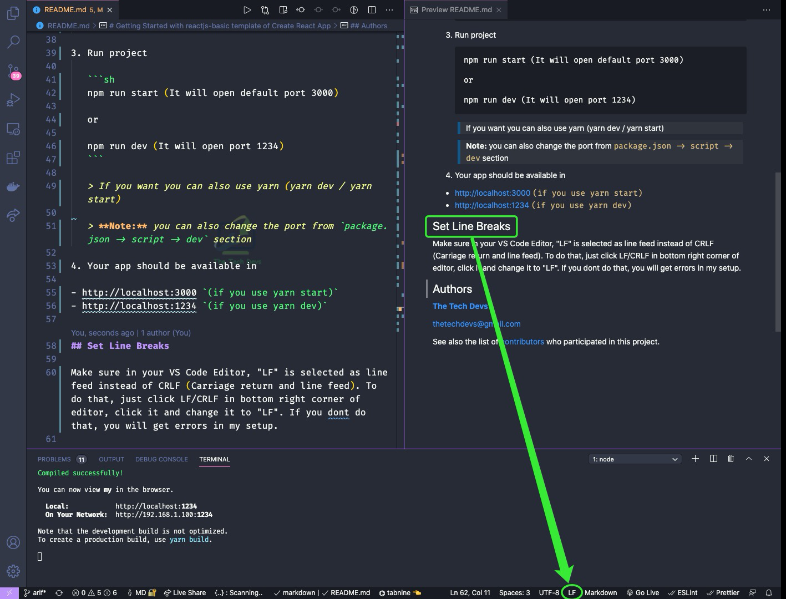

# Getting Started with reactjs-basic template of Create React App

This project was created with [reactjs-basic](https://github.com/thetechdevs/template) template of `create-react-app`.

Your React project will lint and format automatically according to popular airbnb style guide. To do this use **`ctrl+s`** or **`cmd+s`**

## How use this template?

To use this template, add `--template reactjs-basic` when creating a new app.

For example:

```sh
npx create-react-app my-app --template reactjs-basic

# or

yarn create react-app my-app --template reactjs-basic
```

## How to run `(recommended)`

Please follow the below instructions to run this project in your computer:

1. Go to the inside of the project directory

   ```sh
   cd my-app
   ```

2. Config vscode for best user experience and best practice

   ```sh
   yarn cfg

   or

   yarn cfg
   ```

3. Run project

   ```sh
   yarn start (It will open default port 3000)

   or

   yarn dev (It will open port 1234)
   ```

   > If you want you can also use yarn (yarn dev / yarn start)

   > **Note:** you can also change the port from `package.json -> script -> dev` section

4. Your app should be available in

    - http://localhost:3000 `(if you use yarn start)`
    - http://localhost:1234 `(if you use yarn dev)`

### Set Line Breaks

Make sure in your VS Code Editor, "LF" is selected as line feed instead of CRLF (Carriage return and line feed). To do that, just click LF/CRLF in bottom right corner of editor, click it and change it to "LF". If you don't do that, you will get errors in this setup.



## Authors

**[The Tech Devs](https://github.com/thetechdevs)**

thetechdevs@gmail.com

See also the list of [contributors](https://github.com/thetechdevs/template/graphs/contributors) who participated in this project.
